# Spring 2018
# Project 1: Spooky Data Analysis

----

### [Project Description](doc/)
This is the first and only *individual* (as opposed to *team*) this semester. 

Term: Spring 2018

+ Project title: Spooky Data Analysis
+ This project is conducted by Juho Ma (jm4382)
+ Project summary: This project studies the `spooky.csv` data, which contains text excerpts from three popular horror authors, Edgar Allan Poe, HP Lovecraft, and Mary Shelley. By using different methods of text analysis, it attempts to demonstrate similarities and differences among the three authors' texts, and to find patterns that could characterize the writing styles of the authors.

### Summary

1. Stylistically, HPL generally uses the longest sentences among three, both in terms of the number of characters and the number of words, and EAP the shortest among three. 

2. In the use of vocabulary, EAP uses longer words, compared to the other two, although the difference is minor. MWS dominantly uses female indicators and pronouns in her writing, compared to HPL who rarely uses them in his. The difference between HPL and EAP is also significant.

3. MWS has the most characteristic use of vocabulary of all three, using lots of names and positive words like `life`, `love`, and `heart`. HPL and AEP's frequently used words (`folk`, `bearded`, `brown`, or `attic` vs. `monsieur` or `madame`) also show the clear difference between two writer's preferred settings in their stories. This result is consistent in the analysis of bigrams. 

4. MWS's use of lots of positive words create a positive sentiment in her writing, clearly distinguishing her from the other two. HPL's sentiment is the most negative among three, with relatively little use of positive words in his writing. EAP's sentiment is more neutral, and we can further see some differences in how each author's sentiment is manifested.

### Length of Sentences

Length of sentence is oftentimes one of the most distinctive characteristics of one's writing. We can measure the length of sentences from two different perspectives: 1) the number of characters in a sentence, and 2) the number of words in a sentence.

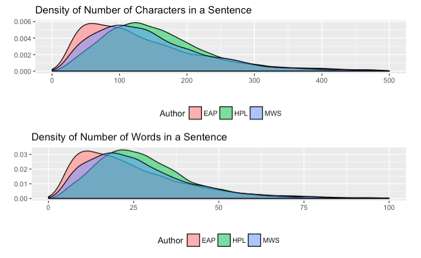

From the summary, we can see that the two measures of the length of sentence, 1) the number of characters in a sentence and 2) the number of words in a sentence show a similar pattern. If you compare this result among three authors, HPL generally uses the longest sentences among three, both in terms of the number of characters and the number of words, and EAP the shortest among three. 

### Use of Punctuation Marks

The use of punctuation marks in a sentence can also significantly characterize one's writing style. Although previously we could see HPL's sentences are generally longer than the other two, here, we see that he uses less punctuation marks such as commas, semicolons, and colons. Although the differences are minor, we can argue that longer sentences with fewer punctuation marks is a distinctive characteristic of HPL.

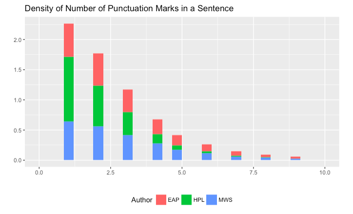

### Length of Words

The first characteristic we can look at is the length of each word the writers use. Unfortunately, we don't see a great difference among three authors. The graph shows similar distributions among three authors, although EAP's shows slightly greater use of longer words.

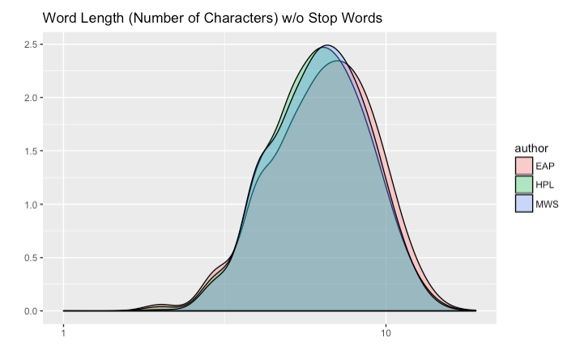

### Gender Representation

We can also look at how different genders are represented in each author's writings. By comparing `man` and `woman`, `he` and `she`, `him` and `her`, and other male and female gender indicators, we will see how three authors differ in their preference in the gender representation.

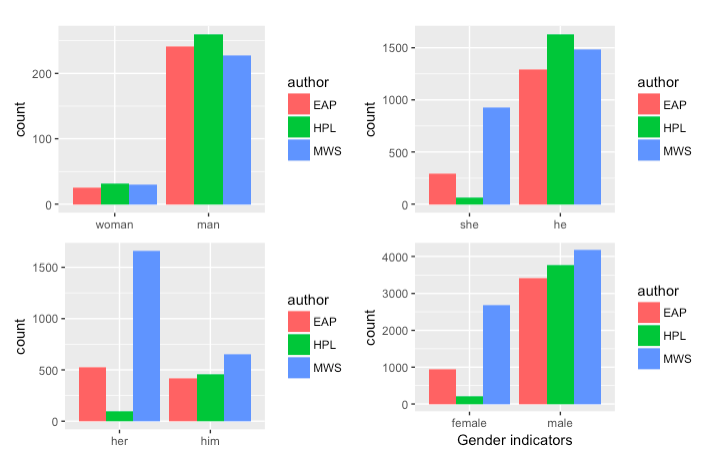

Overall, HPL rarely uses female representation in his writing. MWS, on the other hand, dominantly uses female indicators in her writing, which may not be so surprising considering she herself was a female writer. The difference between EAP and HPL in use of `she`, `her`, or other female indicators is also significant, which means it can be a distinguishing characteristic between the two.

### Word Frequency

Among the most frequently used words, some words are preferred by specific authors and some not. For example, MWS uses words like `life`, `love`, and `heart` a lot more frequently compared to the other two authors.

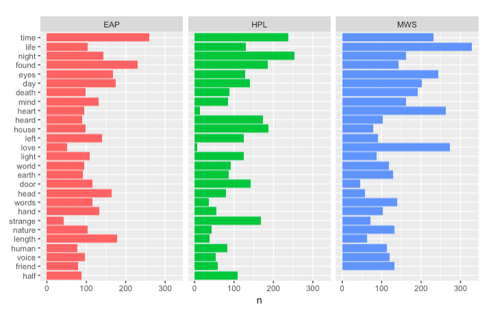

### TF-IDF

TF-IDF is a heuristic index that indicates how frequent a word is used by a certain author relative to other authors. From this analysis, we can find words that are characteristic for a specific author, which can be useful in identifying the author from a given text.

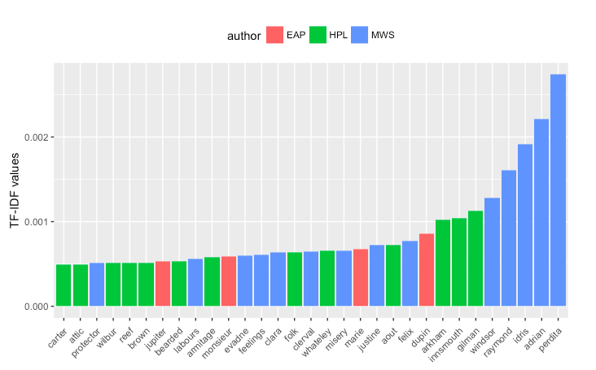

From looking at the result, we can see that MWS has the most characteristic use of vocabulary of all three authors, especially in her use of names. These names appear a lot more frequently in her writings than other names do in EAP or HPL's writings. 

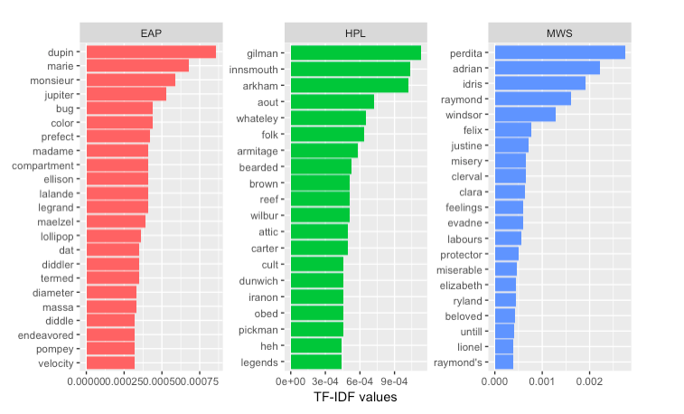

Among the non-name words, HPL's use of words such as `folk`, `bearded`, `brown`, or `attic` stands out, as they share similar associations that may be characteristic to the settings in his writings. Words such as `monsieur` or `madame` in EAP's writing can be an indication that the settings in his stories are quite different from those in the other two authors' stories.

### Bigrams

How words appear together can also be an important indicator for the author's identity. We can look at bigrams, a pair of two words, and find meaningful patterns in each author's writings. After filtering out stop words, the TF_IDF values for each author's bigrams appear as follows:

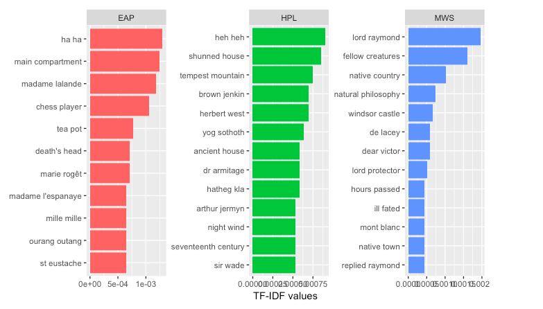

Here, we can also see EAP's characteristic settings from words like `main compartment`, `chess player`, or `tea pot`. HPL's more natural settings, as previously indicated before, can also be seen from words such as `tempest mountain` or `night wind`.

## Sentiment Analysis

We can analyze sentiments of a sentence by looking at the words and its positive/negative sentiments in it. Here, we apply NRC sentiment lexicon which associates words with eight basic emotions (anger, fear, anticipation, trust, surprise, sadness, joy, and disgust) and two sentiments (positive and negative).

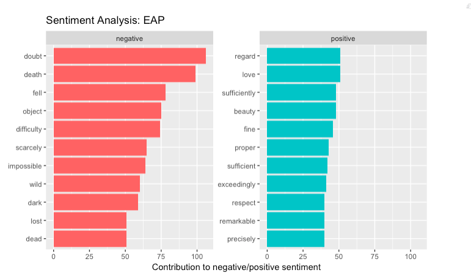
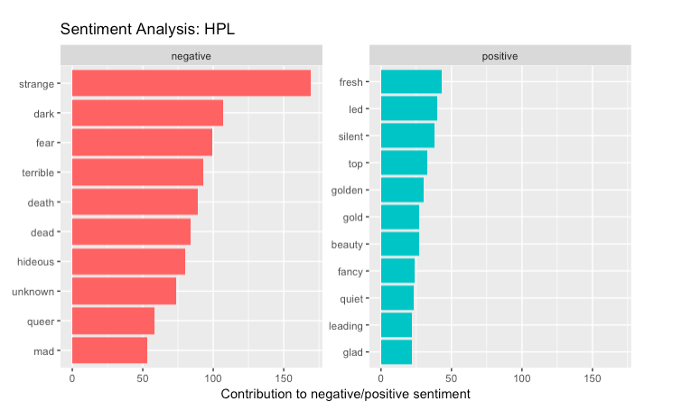
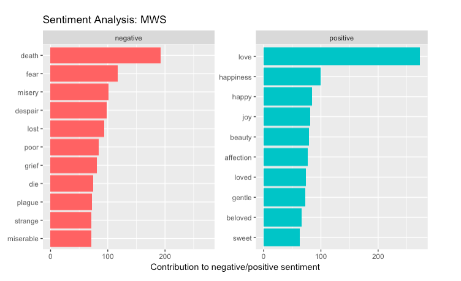

Comparing MWS with EAP and HLP, we can clearly see that her use of positive words is very characteristic of her style. Words such as `love`, `happy`, and `joy` are as frequent as negative words such as `death`, `fear`, or `misery`, which is quite surprising considering the genre of her writing. Also, as we have seen from the analysis of vocabulary, EAP and HPL exhibit distinctive sentiments in their writings as well. Although both of their writings are predominantly negative, EAP's negative sentiment is more obscure and indirect, compared to HPL's (`doubt`, `difficulty`, `lost` vs. `strange`, `terrible`, `hideous`). EAP's positive words also show more refined sentiments with words such as `regard`, `beauty`, or `respect`, which is consistent from other aspects of his writings.

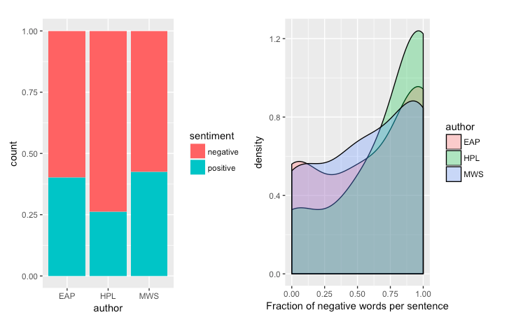

Overall, HPL's sentiment is the most negative among three, with relatively little use of positive words in his writing. MWS shows the least negative sentiment in general, but EAP also used positive sentiments to maintain more neutral tone of the writing as well.

---

Following [suggestions](http://nicercode.github.io/blog/2013-04-05-projects/) by [RICH FITZJOHN](http://nicercode.github.io/about/#Team) (@richfitz). This folder is organized as follows.

```
proj/
├── lib/
├── data/
├── doc/
├── figs/
└── output/
```
